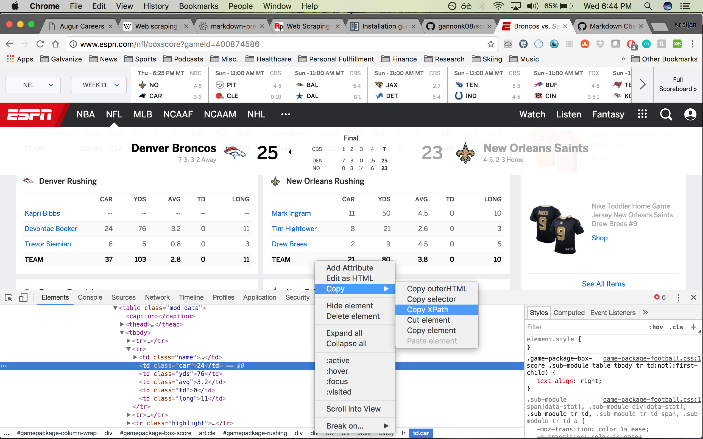
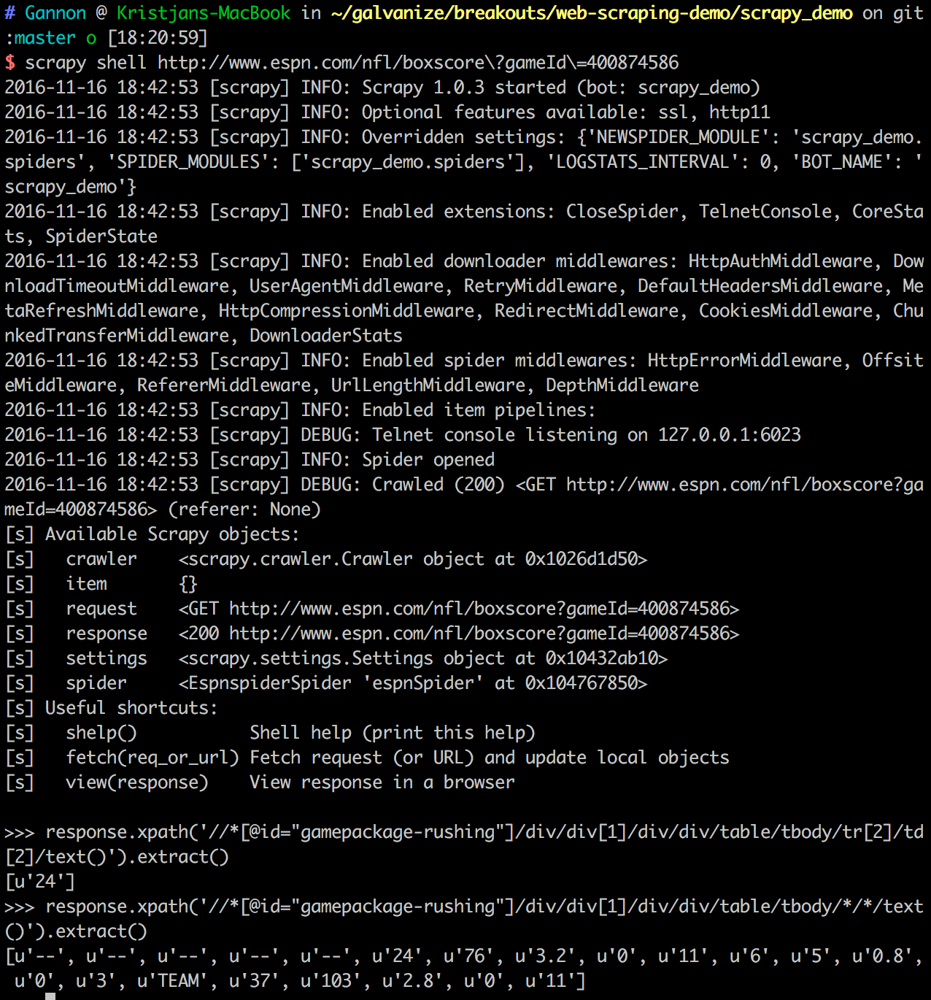

#Scrapy Demo

##Initial Scrapy Set Up:
1. Install Scrapy
  * `pip install scrapy==1.0.3`

1. Create a virtual envirnoment
  * `virtualenv env`

1. Start new project
  * `scrapy startproject <project name>`

1. Cd into project
  * `cd <project name>`

1. Run spider generator
  * `scrapy genspider <spider name> <spider url>`

1. Define what we are looking for in items.py `scrapy_demo/scrapy_demo/items.py`
  ```python import scrapy

  from scrapy.item import Item, Field

  class awayTeamRushItem(Item):
      rusher = Field()
      car = Field()
      yds = Field()
      avg = Field()
      td = Field()
      longest = Field()


  class homeTeamRushItem(Item):
      rusher = Field()
      car = Field()
      yds = Field()
      avg = Field()
      td = Field()
      longest = Field()
```
## Exploring websites with XPath
  * Each html item has a unique XPath

  * This XPath is fairly logical, take the XPath for DeVontae Booker's carries:
  `//*[@id="gamepackage-rushing"]/div/div[1]/div/div/table/tbody/tr[2]/td[2]`

  

  * We can see that starting at the table div ID, the first unique indicator of the table, we go further down the HTML tree until we arrive at the specific data cell for the carries

  * What if we want to get every one of the rows and every data cell in the table body?

    * Simple! Use a wildcard (*) in the tr and td that are specific to the individual data point like below:

      `//*[@id="gamepackage-rushing"]/div/div[1]/div/div/table/tbody/*/*`
  * Okay so lets test this out, we have two options we have xpath in the console or scrapy shell, I will go over scrapy shell since it is more related to our project

  * Back in the command line run the following command:
  `scrapy shell http://www.espn.com/nfl/boxscore\?gameId\=400874586`

  * this command creates an instance of the web page to test out scrapy commands, this is important as to limit the number of request to the web page so you dont get blocked by the server

  * try out the initial XPath we copied in scrapy, notice how it returns an array of one value, the number of carries

  * now try the one with the wild cards and notice how it returns "all" of the data cells in the table, with the exception of the player name since that has another level of HTML elements in it, for now we will skip that. You should see something similar to the picture below:

  
