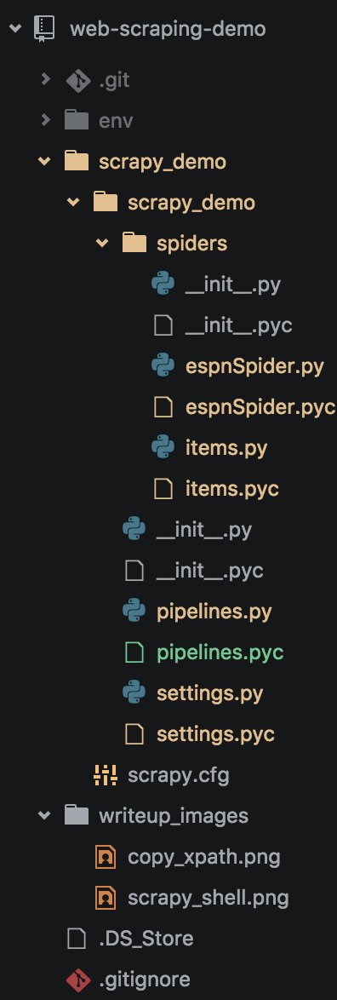

#Scrapy Demo
This repo demonstrates the basic capabilities of Scrapy an python based web-scraping package

##Initial Scrapy Set Up:
1. Install Scrapy
  * `pip install scrapy==1.0.3`

1. Create a virtual envirnoment
  * `virtualenv env`

1. Start new project
  * `scrapy startproject <project name>`

1. Cd into project
  * `cd <project name>`

1. Run spider generator
  * `scrapy genspider <spider name> <spider url>`

1. Define what we are looking for in items.py `scrapy_demo/scrapy_demo/items.py`
```python
import scrapy

  from scrapy.item import Item, Field

  class awayTeamRushItem(Item):
      rusher = Field()
      car = Field()
      yds = Field()
      avg = Field()
      td = Field()
      longest = Field()


  class homeTeamRushItem(Item):
      rusher = Field()
      car = Field()
      yds = Field()
      avg = Field()
      td = Field()
      longest = Field()
```
## Exploring websites with XPath
  * Each html item has a unique XPath

  * This XPath is fairly logical, take the XPath for DeVontae Booker's carries:
  `//*[@id="gamepackage-rushing"]/div/div[1]/div/div/table/tbody/tr[2]/td[2]`

  

  * We can see that starting at the table div ID, the first unique indicator of the table, we go further down the HTML tree until we arrive at the specific data cell for the carries

  * What if we want to get every one of the rows and every data cell in the table body?

    * Simple! Use a wildcard (*) in the tr and td that are specific to the individual data point like below:

      `//*[@id="gamepackage-rushing"]/div/div[1]/div/div/table/tbody/*/*`
  * Okay so lets test this out, we have two options we have xpath in the console or scrapy shell, I will go over scrapy shell since it is more related to our project

  * Back in the command line run the following command:
  `scrapy shell http://www.espn.com/nfl/boxscore\?gameId\=400874586`

  * this command creates an instance of the web page to test out scrapy commands, this is important as to limit the number of request to the web page so you dont get blocked by the server

  * try out the initial XPath we copied in scrapy, notice how it returns an array of one value, the number of carries

  * now try the one with the wild cards and notice how it returns "all" of the data cells in the table, with the exception of the player name since that has another level of HTML elements in it, for now we will skip that. You should see something similar to the picture below:

  

## Back to the Spider

  * So now that we have the desired XPaths we can set up the spider

  * From the generator we have some base codes to work off of however we need move some files around and attach them before we get things going.

### Create Item

  * First move the `items.py` into the spiders folder so your file structure looks like this:

    

  * In that `items` file create a class called `awayTeamRushItem`. The file should appear as so:

  ```python
  import scrapy

  from scrapy.item import Item, Field

  class awayTeamRushItem(Item):
      test = 'this is a test item'
      rusher = Field()
      car = Field()
      yds = Field()
      avg = Field()
      td = Field()
      longest = Field()
  ```
  * Now lets import this class to the espnSpider and set it up

### Start URL and Rules

  * The `start_urls` are specific urls which the spider will crawl through based on some rules, for now we wont get into rules but they can be used to go through paginated results, into links to other webpages etc. So setting that to the espn url our file should look something like this:

  ```python
  import scrapy
  from scrapy.linkextractors import LinkExtractor
  from scrapy.spiders import CrawlSpider, Rule
  from scrapy.item import Item, Field


  from items import awayTeamRushItem
  import logging
  import re

  class EspnspiderSpider(scrapy.Spider):
      name = "espnSpider"
      allowed_domains = ["espn.com"]
      start_urls = (
          'http://www.espn.com/nfl/boxscore?gameId=400874586',
      )

      rules = (
          Rule(LinkExtractor(), callback='parse_item', follow=False),
      )
  ```
### Parsing Data

  * So probably the most important part to a spider is how you parse through the HTML on the web page

  * The `def parse(self, response):` function uses generators to create instances of the `awayTeamRushItem` add data to that instance and then add it to a pipeline, which can connect to a database, write it to a json, csv, etc. a while pausing the `for` loop

  * To parse our rushers lets set up a for in loop to go through each rusher and create an instance of the `awayTeamRushItem`

  ```python
    def parse(self, response):
      rushers = response.xpath('//*[@id="gamepackage-rushing"]/div/div[1]/div/div/table/tbody/*/td[1]/a/span[1]/text()').extract()

      for rusher in rushers:
          awayItem = awayTeamRushItem()

          awayItem['rusher'] = rusher

          yield awayItem
  ```
  * So now that you can see the process for an individual stat lets add the rest so the parse function should look something like this:

  ```python
  global awayItem
    awayItem = awayTeamRushItem()

    def parse(self, response):
          rushers = response.xpath('//*[@id="gamepackage-rushing"]/div/div[1]/div/div/table/tbody/*/td[1]/a/span[1]/text()').extract()

          carries = response.xpath('//*[@id="gamepackage-rushing"]/div/div[1]/div/div/table/tbody/*/td[2]/text()').extract()

          yards = response.xpath('//*[@id="gamepackage-rushing"]/div/div[1]/div/div/table/tbody/*/td[3]/text()').extract()

          averages = response.xpath('//*[@id="gamepackage-rushing"]/div/div[1]/div/div/table/tbody/*/td[4]/text()').extract()

          touchdowns = response.xpath('//*[@id="gamepackage-rushing"]/div/div[1]/div/div/table/tbody/*/td[5]/text()').extract()

          longs = response.xpath('//*[@id="gamepackage-rushing"]/div/div[1]/div/div/table/tbody/*/td[6]/text()').extract()

          awayItemIndex = 0

          for rusher in rushers:
              awayItem = awayTeamRushItem()

              awayItem['car'] = str(carries[awayItemIndex])
              awayItem['yds'] = str(yards[awayItemIndex])
              awayItem['avg'] = str(averages[awayItemIndex])
              awayItem['td'] = str(touchdowns[awayItemIndex])
              awayItem['longest'] = str(longs[awayItemIndex])
              awayItem['rusher'] = str(rusher)

              awayItemIndex+=1

              yield awayItem
  ```

## Scraping to a PostGreSQL DataBase via pipelines

As mentioned above pipelines connect the spider to database and other forms of storing and or handling the scraped data. For this demo we will add the data to a PostGreSQL database.

1.  Install PostGreSQL Python wrapper
  * `pip install psycopg2`

1.  Setup the PSQL DB in the commandline
  * `createdb scraping_demo`
  * `CREATE TABLE awayTeamRush (rusher varchar(40), car varchar(40), yds varchar(40), avg varchar(40), td varchar(40), longest varchar(40));`

* Now lets add a connection from pipeline to the spider in the `settings.py` add the following changing the database to the name you choose for the db

```python

DOWNLOAD_DELAY = 5

DOWNLOADER_MIDDLEWARES = {'scrapy.downloadermiddlewares.useragent.UserAgentMiddleware': None,}

RETRY_TIMES = 2
RETRY_HTTP_CODES = [500, 502, 503, 504, 400, 403, 404, 408]

DATABASE = {
    'drivername': 'postgres',
    'host': 'localhost',
    'port': '5432',
    'username': 'Gannon',
    'password': '',
    'database': 'scraping_demo'
}

ITEM_PIPELINES = {
  'scrapy_demo.pipelines.ScrapyDemoPipeline': 300
}
```
* Now that the spider is feeding the pipeline we need to tell psycopg2 how to handle the data

* To do this we need to set up an init function within the pipeline to pass the db parameters to psycopg2 like so:

```python

import psycopg2
import logging
from spiders.items import awayTeamRushItem
from scrapy.conf import settings
from scrapy.exceptions import DropItem


class ScrapyDemoPipeline(object):
  def __init__(self):
    self.connection = psycopg2.connect(host='localhost', database='scraping_demo', user='<psql username>')
    self.cursor = self.connection.cursor()
```
* The last component of the pipeline is passing the yields from the parse generator into the database. Well add a conditional so that we can add different items to different tables as we build out the app further, the whole pipeline should look like this now:

```python
class ScrapyDemoPipeline(object):
  def __init__(self):
    self.connection = psycopg2.connect(host='localhost', database='scraping_demo', user='<psql username>')
    self.cursor = self.connection.cursor()

  def process_item(self, item, spider):
    try:
      if type(item) is awayTeamRushItem:
        table = """awayteamrush"""
        self.cursor.execute("""INSERT INTO """ + table + """  (rusher, car, yds, avg, td, longest) VALUES(%s, %s, %s, %s, %s, %s)""", (item.get('rusher'), item.get('car'), item.get('yds'), item.get('avg'), item.get('td'), item.get('longest')))

      self.connection.commit()
      self.cursor.fetchall()

    except psycopg2.DatabaseError, e:
      print "Error: %s" % e
    return item
```
##Thanks!
  Thanks for checking this demo out hopefully this inspires you to create some sweet apps!
